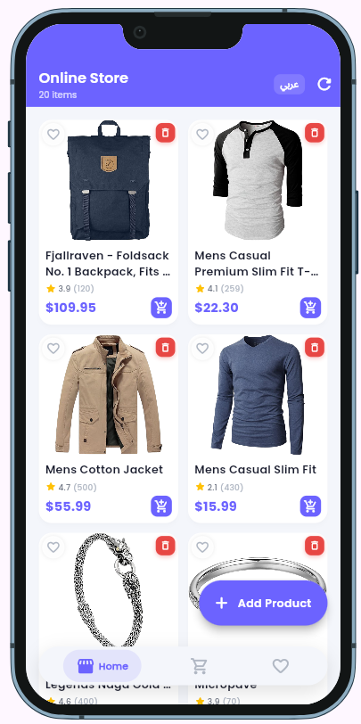
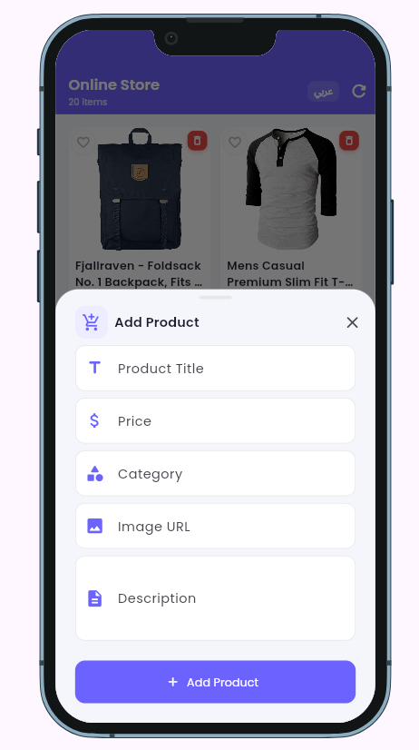

# 🛍️ Online Store — Flutter E-Commerce App

A fully-featured e-commerce mobile application built with Flutter, following Clean Architecture principles and supporting both Arabic and English languages.

---

## 📱 Screenshots

<p align="center">
  
  &nbsp;&nbsp;
  
</p>

---

## ✨ Features

- 🛒 **Product Listing** — Fetches products from [FakeStore API](https://fakestoreapi.com) with a beautiful masonry grid layout
- ❤️ **Favorites** — Add/remove products to a favorites list
- 🛍️ **Shopping Cart** — Full cart management: add, remove, adjust quantity
- 💳 **Checkout & Payment** — Multi-step checkout with address form, country selector, and credit card support
- 🌍 **Multi-language** — Full Arabic & English support with dynamic switching (RTL/LTR)
- 🌙 **Dark / Light Theme** — Material 3 theming with Poppins font
- 💾 **Offline Caching** — SQLite on native platforms, SharedPreferences on Web
- 📦 **Add Products** — Manually add new products via a bottom sheet form

---

## 🏗️ Architecture

This project follows **Clean Architecture** with a feature-first folder structure:

```
lib/
├── core/                  # Shared utilities, theme, constants, network
│   ├── constants/         # Colors, sizes, strings
│   ├── theme/             # App theme & text styles
│   ├── l10n/              # Localizations (EN & AR)
│   ├── network/           # Dio HTTP client & API endpoints
│   ├── error/             # Failure models
│   └── widgets/           # Shared widgets (FloatingNavBar)
│
└── features/
    ├── products/           # Product listing, add, delete
    ├── cart/               # Shopping cart
    ├── favorites/          # Favorites list
    ├── payment/            # Checkout & payment flow
    ├── language/           # Language switching
    └── main/               # Main shell / navigation
```

Each feature follows the **Domain → Data → Presentation** pattern:

| Layer        | Responsibilities                                      |
|--------------|-------------------------------------------------------|
| Domain       | Entities, Repository interfaces, Use Cases            |
| Data         | Models, Remote & Local DataSources, Repository impl   |
| Presentation | Pages, Widgets, Cubits (BLoC state management)        |

---

## 🧰 Tech Stack

| Category             | Package                                      |
|----------------------|----------------------------------------------|
| State Management     | `flutter_bloc` ^9.1.1                        |
| Dependency Injection | `get_it` + `injectable`                      |
| HTTP Client          | `dio` ^5.7.0                                 |
| Local DB (native)    | `sqflite` + `sqflite_common_ffi`             |
| Local DB (web)       | `shared_preferences`                         |
| Image Caching        | `cached_network_image`                       |
| SVG Support          | `flutter_svg`                                |
| Credit Card UI       | `flutter_credit_card`                        |
| Grid Layout          | `flutter_staggered_grid_view`                |
| Fonts                | `google_fonts` (Poppins)                     |
| Localization         | `intl` + `flutter_localizations`             |
| Equality             | `equatable`                                  |
| Dev Preview          | `device_preview`                             |

---

## 📂 Key Screens

### 🏠 Products Page
- Masonry grid with staggered layout
- Pull-to-refresh
- Add new products (FAB → Bottom Sheet)
- Per-product: image, title, price, star rating
- Add to cart / favorites / delete — all from the card

### 🛒 Cart Page
- List of added products with increment / decrement quantity
- Real-time total calculation
- Free shipping indicator
- Proceed to Checkout button

### ❤️ Favorites Page
- All favorited products in a clean list
- Toggle to remove from favorites

### 💳 Payment Page
Multi-step checkout flow:
1. Order summary
2. Delivery address form
3. Country selector (10 countries: KSA, UAE, Egypt, and more)
4. Payment method: Cash on Delivery or Credit Card
5. Live credit card preview while typing
6. Confirmation dialog → cart cleared → redirect home

---

## 🌍 Localization

The app supports **English** and **Arabic** with full RTL layout support, persisted via SharedPreferences.

---

## 🚀 Getting Started

### Prerequisites

- Flutter SDK `>=3.0.0`
- Dart SDK `>=3.0.0`

### Installation

```bash
# Clone the repository
git clone https://github.com/your-username/online_store.git
cd online_store

# Install dependencies
flutter pub get

# Generate dependency injection code
dart run build_runner build --delete-conflicting-outputs

# Run the app
flutter run
```

---

## 📡 API

This app uses the free [FakeStore API](https://fakestoreapi.com):

| Method | Endpoint    | Description        |
|--------|-------------|--------------------|
| GET    | `/products` | Fetch all products |

---

## 🗂️ State Management Overview

| Cubit            | Responsibility                          |
|------------------|-----------------------------------------|
| `ProductCubit`   | Load, add, delete products              |
| `CartCubit`      | Add, remove, increment, decrement items |
| `FavoritesCubit` | Toggle favorites                        |
| `PaymentCubit`   | Handle checkout flow & payment state    |
| `LanguageCubit`  | Switch & persist app language           |

---

## 👨‍💻 Author

**Tarek Khazma**  
Built as a Flutter training project demonstrating Clean Architecture, BLoC state management, and production-level app structure.

---

## 📄 License

This project is for educational purposes.
